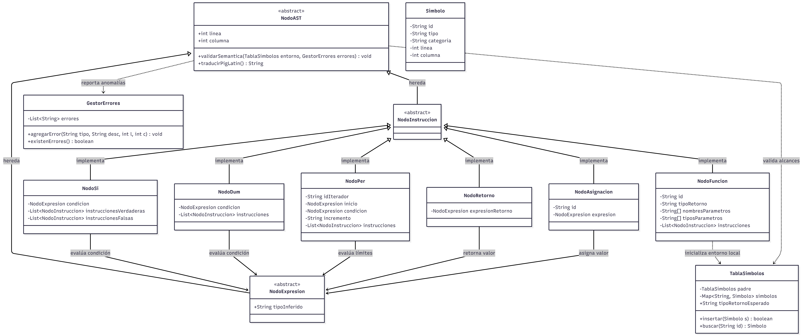

# MANUAL TÉCNICO: PROYECTO CODEX LATINUS

## 1. Introducción
**Codex Latinus** es un compilador de nivel académico desarrollado bajo el ecosistema de Java, Swing y ANTLR 4. Su objetivo principal es analizar, validar semánticamente y traducir código fuente basado en comandos de la Resistencia (estructuras, ciclos, funciones y tipado estricto) hacia representaciones intermedias y de traducción (como Pig Latin), previniendo la corrupción de flujos lógicos mediante un analizador robusto.

---

## 2. Arquitectura y Fases del Compilador
El proceso de compilación se divide en fases secuenciales desacopladas para garantizar la escalabilidad y el mantenimiento:

*   **Análisis Léxico y Sintáctico (Frontend):** Gestionado a través de ANTLR 4 mediante la gramática definida en `Codex.g4`. Produce un árbol de análisis sintáctico (*Parse Tree*).
*   **Construcción del Árbol de Sintaxis Abstracta (AST):** Mediante el patrón de diseño *Visitor* (`ConstructorAST.java`), se recorre el árbol de ANTLR para transformarlo en objetos de nodos propios del AST (`ast.*`).
*   **Análisis Semántico:** Se encarga de la comprobación de tipos, control de ámbitos (*scopes* mediante la `TablaSimbolos`), validación de estructuras, control de flujo estricto y la verificación de retornos en funciones.
*   **Generación de Código / Traducción:** Transformación de los nodos validados a estructuras de salida (como Pig Latin).

---

## 3. Estructura de Paquetes del Proyecto
El código fuente está modularizado en los siguientes paquetes principales:

*   **`analyzer`**: Contiene la gramática (`Codex.g4`) y las clases generadas automáticamente por ANTLR (`Lexer`, `Parser`, `BaseVisitor`).
*   **`ast`**: Contiene la estructura base del Árbol de Sintaxis Abstracta y el patrón Visitor (`ConstructorAST.java`).
    *   **`ast.exp`**: Nodos enfocados en expresiones (literales, operaciones binarias/unarias, accesos a arreglos y structs).
    *   **`ast.stm`**: Nodos enfocados en instrucciones y control de flujo (`NodoSi`, `NodoDum`, `NodoPer`, `NodoFuncion`, `NodoRetorno`, etc.).
*   **`simbolos`**: Gestión de memoria estática y dinámica. Incluye la `TablaSimbolos` jerárquica y los objetos `Simbolo`.
*   **`errores`**: Subsistema de control encargado de capturar, almacenar y reportar errores léxicos, sintácticos y semánticos con su respectiva línea y columna.
*   **`traductor`**: Módulos de traducción de instrucciones al lenguaje destino (Pig Latin).

---

## 4. Componentes Críticos y Validaciones Semánticas

### A. Control de Flujo Estricto (Prevención de Corrupción)
Las estructuras condicionales y ciclos (`si`, `dum`, `facere`, `per`) evalúan de forma estricta que el tipo inferido de la condición sea un booleano (`bool`). Cualquier intento de evaluar un tipo numérico o de otra índole detiene la compilación lanzando un error de *Corrupción de Flujo*.

### B. Sistema de Tipos y Promociones
El sistema de tipos valida la compatibilidad estricta. Se permite únicamente la promoción implícita segura (de `numerus` a `decimalis`), reportando advertencias o errores fatales ante pérdidas de precisión inversas o incompatibilidades totales (`textum` con `bool`).

### C. Gestión de Ámbitos y Funciones (`Actio` y `Ratio`)
*   Las funciones de tipo **`ratio`** exigen obligatoriamente una instrucción de retorno (`reddere`) que coincida en tipado con la firma de la función.
*   Las funciones de tipo **`actio`** bloquean cualquier instrucción `reddere` con valor.
*   Se implementó una verificación de alcances basada en la pila de entornos de la `TablaSimbolos` para validar parámetros y variables locales declaradas estrictamente al inicio de los bloques permitidos.

---

## 5. Compilación y Despliegue (Maven)

El proyecto está configurado para compilarse mediante **Apache Maven** (versión recomendada de Java: 21).

### Dependencias Principales (`pom.xml`)
*   **ANTLR 4 Runtime (`4.13.2`)**: Motor de análisis léxico y sintáctico.
*   **JGraphX (`4.2.2`)**: Librería utilizada para la representación gráfica opcional del AST.

### Comandos de Compilación
Para limpiar, generar las clases de ANTLR, compilar el código Java y empaquetar un archivo ejecutable JAR con todas sus dependencias (*fat-jar*), utilice el siguiente comando en la terminal:

```bash
mvn clean package
````
El artefacto resultante se ubicará en la carpeta (`/target`) bajo el nombre de `CodexLatinus-1.0-SNAPSHOT-jar-with-dependencies.jar`, listo para ejecutarse mediante:
```bash
java -jar target/CodexLatinus-1.0-SNAPSHOT-jar-with-dependencies.jar
```
## 6. Especificaciones de Palabras Reservadas, Símbolos y Gramática

### A. Palabras Reservadas
El lenguaje **Codex Latinus** utiliza terminología inspirada en el latín clásico adaptada para la lógica del compilador de la Resistencia:

*   **Tipos de Datos:** `numerus` (entero), `decimalis` (decimal), `textum` (cadena de texto), `bool` (booleano: `verum` / `falsus`).
*   **Secciones Principales:** `VARIABILES`, `MUNERA` (funciones), `MAIOR` (bloque principal).
*   **Estructuras de Control:** `si` (if), `aliter` (else / else-if), `dum` (while), `facere` (do-while), `per` (for).
*   **Control de Flujo en Ciclos:** `perge` (continue), `interrumpe` (break).
*   **Funciones y Retorno:** `actio` (procedimiento sin retorno), `ratio` (función con retorno), `reddere` (return).
*   **Declaración y Cierre:** `esto` (declaración de variable), `finis` (cierre de bloques de código).

### B. Símbolos y Operadores
*   **Asignación:** `=`
*   **Aritméticos:** `+`, `-`, `*`, `/`
*   **Relacionales:** `==`, `!=`, `>`, `<`, `>=`, `<=`
*   **Lógicos:** `&&` (and), `||` (or), `!` (not)
*   **Incremento/Decremento:** `++`, `--`
*   **Puntuación:**
    *   `;` (Fin de instrucción)
    *   `:` (Separador de identificador y tipo)
    *   `,` (Separadores de parámetros en funciones)
    *   `{ }` (Agrupación de bloques de instrucciones)
    *   `( )` (Agrupación de condiciones o parámetros)

---

## 7. Tabla de Compatibilidad de Tipos y Operaciones

El compilador aplica un sistema de tipado estricto. Permite promociones implícitas seguras, pero bloquea las pérdidas de precisión o las mezclas incompatibles de tipos durante la asignación y las operaciones.

### A. Compatibilidad en Asignaciones y Retornos
Esta matriz define qué ocurre al intentar asignar un valor o retornar una expresión (columna) hacia una variable o firma de función (fila).

| Tipo Destino / Esperado | `numerus` | `decimalis` | `textum` | `bool` |
| :--- | :--- | :--- | :--- | :--- |
| **`numerus`** | Válido | Error (Pérdida precisión) | Incompatible | Incompatible |
| **`decimalis`** | Válido (Promoción implícita)| Válido | Incompatible | Incompatible |
| **`textum`** | Incompatible | Incompatible | Válido | Incompatible |
| **`bool`** | Incompatible | Incompatible | Incompatible | Válido |

### B. Matriz de Operaciones Aritméticas (Operador Suma `+`)
Cuando se combinan distintos tipos de datos en una expresión binaria de adición, el compilador infiere el tipo resultante o lanza un error semántico según la siguiente lógica:

| Operando A \ Operando B | `numerus` | `decimalis` | `textum` | `bool` |
| :--- | :--- | :--- | :--- | :--- |
| **`numerus`** | `numerus` | `decimalis` | `textum` (Concatenación)| Error semántico |
| **`decimalis`** | `decimalis` | `decimalis` | `textum` (Concatenación)| Error semántico |
| **`textum`** | `textum` (Concatenación)| `textum` (Concatenación)| `textum` (Concatenación)| `textum` (Conversión a string)|
| **`bool`** | Error semántico | Error semántico | Error semántico | Error semántico |

> **Nota de Seguridad de Tipos:** Cualquier operación de concatenación con un `textum` forzará a los demás operandos a convertirse en cadenas de texto, resultando en un nuevo `textum`. Las operaciones aritméticas (`-`, `*`, `/`) con tipos `textum` o `bool` no están permitidas y generan un error semántico de incompatibilidad.

## 8. Diagrama de Clases del Compilador

A continuación se muestra el diagrama de la arquitectura del sistema:

 
