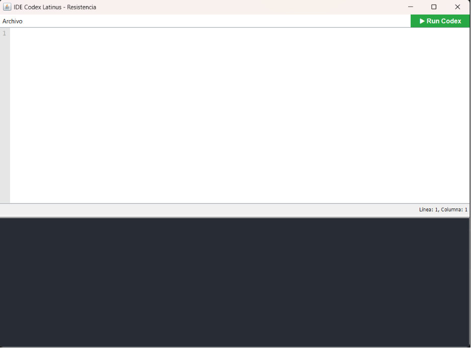
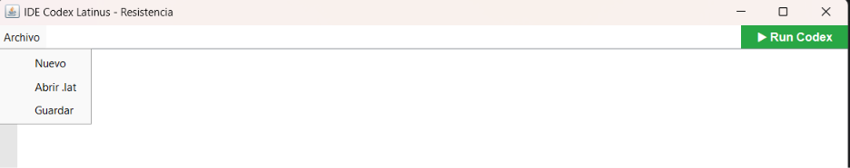
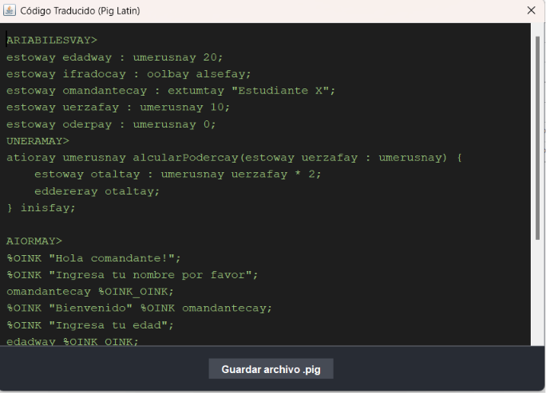
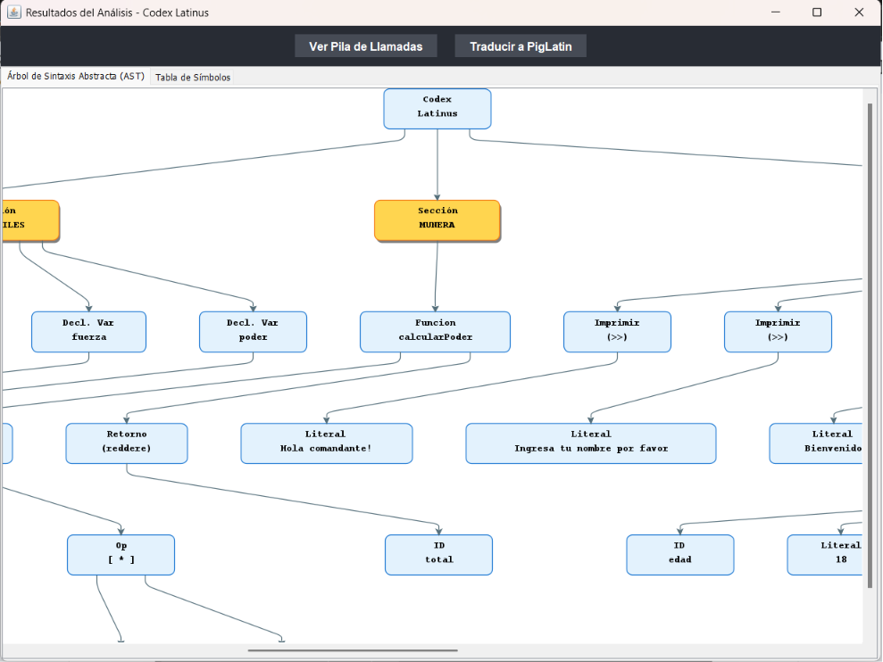
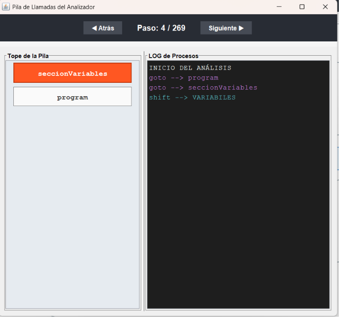
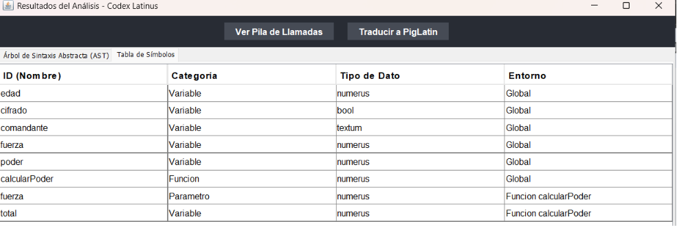

# MANUAL DE USUARIO: CODEX LATINUS

## 1. Introducción y Estructura Básica
¡Bienvenido a la red de la Resistencia! **Codex Latinus** es el entorno de desarrollo diseñado para escribir, compilar y validar nuestras comunicaciones de forma segura.

Encontraras una ventana principal con un editor y una consola que te indicara los errores lexicos, sintacticos y semanticos.

Todo algoritmo debe dividirse estrictamente en tres secciones principales (obligatoriamente en este orden):

```latin
VARIABILES>
// 1. Declaración de variables globales
MUNERA>
// 2. Definición de funciones
MAIOR>
// 3. Bloque principal de ejecución
>> "Iniciando protocolos...";
FINIS;
```
Podras encontrar un menu para guardar tus archivos.


## 2. Tipos de Datos y Variables
El sistema cuenta con un tipado estricto para proteger la integridad de la información. Para declarar una variable, se utiliza la palabra reservada esto, seguida del nombre de la variable, su tipo y su valor asignado.

* **numerus:** Números enteros (Ej: esto nivel : numerus 10;).

* **decimalis:** Números con punto decimal (Ej: esto peso : decimalis 3.14;).

* **textum:** Cadenas de texto encerradas entre comillas (Ej: esto msj : textum "Alerta";).

* **bool:** Valores lógicos de la Resistencia. Solo admite verum (verdadero) o falsus (falso).

## 3. Flujo de Control y Funciones
Para evitar la corrupción lógica por parte de los Cerdos, las evaluaciones en ciclos y sentencias condicionales deben resultar estrictamente en un valor booleano (bool). Cualquier intento de evaluar un número o texto directamente será bloqueado.

* **Condicionales y Ciclos Condicionales:** Usa si, aliter si y aliter para la toma de decisiones. Todo bloque si debe cerrarse con finis;.

* **Ciclos Iterativos:** Puedes utilizar dum (mientras), facere...dum (hacer-mientras) y per (para).

* **Interrupciones:** Para controlar las iteraciones internas, emplea perge (continuar) e interrumpe (romper ciclo).

* **Modularidad (Funciones)
Procedimientos (actio):** Funciones que ejecutan tareas específicas y tienen estrictamente prohibido retornar valores.

* **Funciones con retorno (ratio):** Operaciones que deben devolver obligatoriamente un valor (utilizando la instrucción reddere) que coincida con el tipo declarado.

* **Variables locales:** Dentro de cualquier función, las variables locales solo pueden declararse al inicio, utilizando el bloque delimitador **`VARIABILES[ ... ]`**.

## 4. Traducción a Pig Latin
Como medida adicional de seguridad, Codex Latinus incluye un traductor automático de instrucciones a Pig Latin, un sistema de ofuscación de la Resistencia.

Cuando el código pasa exitosamente las validaciones semánticas, el compilador puede generar un archivo de salida donde las instrucciones clave (como los identificadores, ciertas palabras reservadas y valores textuales) se transforman siguiendo las reglas fonéticas del Pig Latin, dificultando el rastreo de los Cerdos si interceptan las comunicaciones.



## 5. Ejecución y Análisis de Consola
Una vez redactado tu algoritmo en el editor principal, presiona el botón Run Codex. La terminal inferior es tu herramienta de diagnóstico:

**Ejecución Exitosa:** Si la sintaxis y los tipos son correctos, verás el mensaje Análisis Léxico y Sintáctico: OK. El programa completará el árbol y ejecutará las rutinas sin alertas rojas.



**Gestión de Errores:** Si se detecta una anomalía (ej. intentar guardar texto en un numerus, o escribir una variable fuera de lugar), el compilador abortará inmediatamente el flujo. La terminal te proporcionará la línea, columna y el tipo exacto de fallo (Léxico, Sintáctico o Semántico) junto con una descripción detallada para facilitar su corrección inmediata.

Ademas si no tenemos ningun error podemos acceder a ver la **`Pila de Llamadas`**.

 

Y tambien podremos ver la **`Tabla de Simbolos`**

 